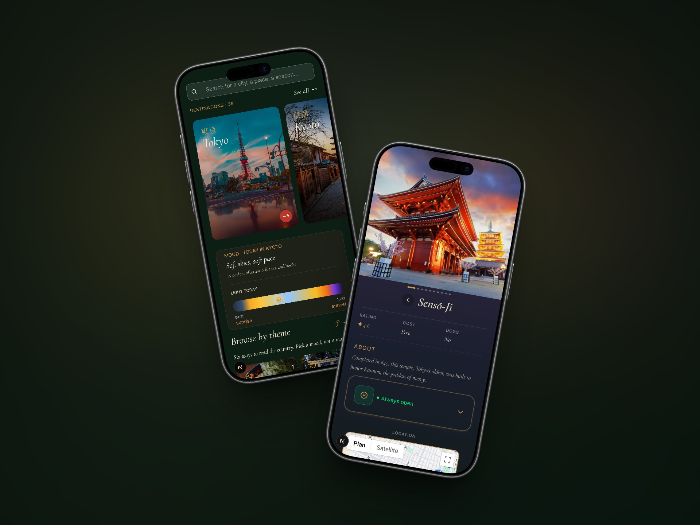

# 木漏れ日 Komorebi

> *Komorebi (木漏れ日) — the sunlight that filters through the leaves of trees.*

A travel discovery app for exploring Japan's cities — matched to your mood, the weather, and what's around you.

**[Live demo →](https://komorebi-v2.vercel.app/)**

## What it does

Browse Japanese cities and islands, check live weather, get mood-based recommendations, and find curated places to visit — each with photos, ratings, and one-tap directions to Google Maps.

## Stack

Next.js · Supabase · Tailwind CSS · Motion · Google Maps Platform · TypeScript

## A few things worth mentioning

- **Shared geolocation** via React Context — one permission prompt and one GPS call, reused across every component that needs the user's position, instead of each one requesting it separately.
- **Scroll-linked animations** built with Motion's `useMotionValue`/`useTransform` — the destination carousel scales and fades cards based on real scroll position, without triggering React re-renders on every frame.
- **Server-rendered data** — cities and places are fetched directly from Supabase in Server Components, so the page ships with real content, not a loading spinner.

## License

This project is shared for portfolio purposes. All rights reserved — please don't reuse the code without permission.

*Built with 🍃 and a love for quiet places.*
